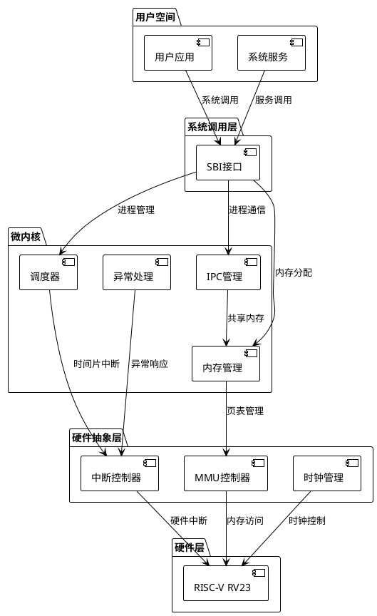

# Lilith OS - 基于Rust的RISC-V RV23微内核操作系统

## 项目概述

Lilith OS 是一个专门针对RISC-V RV23架构优化的现代化微内核操作系统，采用Rust语言开发，旨在提供高性能、高安全性和高可扩展性的系统平台。

### 核心设计理念

- **微内核架构**：借鉴鸿蒙OS的分布式设计理念，实现核心服务分离
- **模块化设计**：参考Linux的模块化架构，支持动态加载和热插拔
- **内存安全**：利用Rust的所有权系统，从根本上避免内存安全问题
- **RISC-V优化**：充分利用RV23架构特性，实现硬件级优化

## 系统架构设计

### 整体架构图 (ASCII)

```
┌─────────────────────────────────────────────────────────────────────────┐
│                           用户空间应用层                                  │
│  ┌─────────────┐ ┌─────────────┐ ┌─────────────┐ ┌─────────────┐        │
│  │   GUI应用   │ │  命令行工具  │ │  系统服务   │ │  第三方应用  │        │
│  └─────────────┘ └─────────────┘ └─────────────┘ └─────────────┘        │
├─────────────────────────────────────────────────────────────────────────┤
│                        系统调用接口层 (SBI)                              │
│  ┌─────────────────────────────────────────────────────────────────────┐ │
│  │  进程管理API │ 内存管理API │ 文件系统API │ 网络API │ 设备API │ IPC API │ │
│  └─────────────────────────────────────────────────────────────────────┘ │
├─────────────────────────────────────────────────────────────────────────┤
│                          用户态服务层                                    │
│  ┌─────────────┐ ┌─────────────┐ ┌─────────────┐ ┌─────────────┐        │
│  │  文件系统   │ │   网络栈    │ │   驱动管理  │ │   GUI服务   │        │
│  │   服务      │ │    服务     │ │    服务     │ │    服务     │        │
│  └─────────────┘ └─────────────┘ └─────────────┘ └─────────────┘        │
├─────────────────────────────────────────────────────────────────────────┤
│                         微内核核心层                                     │
│  ┌─────────────┐ ┌─────────────┐ ┌─────────────┐ ┌─────────────┐        │
│  │  进程调度器  │ │  内存管理器  │ │  IPC管理器  │ │  异常处理器  │        │
│  └─────────────┘ └─────────────┘ └─────────────┘ └─────────────┘        │
├─────────────────────────────────────────────────────────────────────────┤
│                        硬件抽象层 (HAL)                                  │
│  ┌─────────────┐ ┌─────────────┐ ┌─────────────┐ ┌─────────────┐        │
│  │  中断控制器  │ │  内存控制器  │ │  时钟管理器  │ │  电源管理器  │        │
│  └─────────────┘ └─────────────┘ └─────────────┘ └─────────────┘        │
├─────────────────────────────────────────────────────────────────────────┤
│                      RISC-V RV23 硬件层                                 │
│  ┌─────────────────────────────────────────────────────────────────────┐ │
│  │  Machine Mode  │  Supervisor Mode  │  User Mode  │  Vector Extension │ │
│  │  (M-mode)      │  (S-mode)         │  (U-mode)   │  (RVV 1.0)       │ │
│  └─────────────────────────────────────────────────────────────────────┘ │
└─────────────────────────────────────────────────────────────────────────┘
```

### 数据流图 (PlantUML格式)



## RISC-V RV23 架构绑定关系

### 特权模式利用

| 特权模式                 | 用途      | 主要功能            | 实现组件         |
| ------------------------ | --------- | ------------------- | ---------------- |
| Machine Mode (M-mode)    | 固件/引导 | 硬件初始化、SBI实现 | `boot/sbi.rs`    |
| Supervisor Mode (S-mode) | 内核      | 内存管理、进程调度  | `kernel/core.rs` |
| User Mode (U-mode)       | 用户程序  | 应用程序执行        | `userspace/`     |

### 内存管理单元 (MMU) 绑定

```rust
// 页表格式：Sv48 (48位虚拟地址)
pub struct PageTable {
    entries: [PageTableEntry; 512],
}

// 地址空间标识符 (ASID) 优化
pub struct AddressSpace {
    asid: u16,          // RISC-V ASID
    page_table: PageTable,
    memory_regions: Vec<MemoryRegion>,
}
```

### 向量扩展 (RVV 1.0) 利用

```rust
// 向量化内存操作
#[inline(always)]
pub unsafe fn vector_memcpy(dst: *mut u8, src: *const u8, len: usize) {
    // 使用RVV指令进行高效内存拷贝
    asm!(
        "vsetvli t0, {len}, e8, m1",
        "vle8.v v0, ({src})",
        "vse8.v v0, ({dst})",
        len = in(reg) len,
        src = in(reg) src,
        dst = in(reg) dst,
        out("t0") _,
    );
}
```

## 详细开发里程碑

### 第一阶段：裸机引导与基础设施 (4周)

#### 1.1 引导加载器实现 (1周)

**1.1.1 SBI固件开发 (2天)**
- 微功能1：M-mode初始化
  - 设置机器模式寄存器
  - 配置物理内存保护 (PMP)
  - 初始化机器模式异常向量
- 微功能2：硬件发现与初始化
  - 设备树解析
  - 内存布局检测
  - CPU核心数量检测
- 微功能3：S-mode准备
  - 设置监管模式寄存器
  - 配置虚拟内存基础
  - 准备内核入口点

**1.1.2 内核加载器 (2天)**
- 微功能1：ELF内核解析
  - ELF头部验证
  - 程序段加载
  - 符号表处理
- 微功能2：内存布局设置
  - 内核虚拟地址映射
  - 堆栈空间分配
  - 保留内存区域标记
- 微功能3：控制权转移
  - 寄存器状态保存
  - 跳转到内核入口
  - 异常处理准备

**1.1.3 早期调试支持 (3天)**
- 微功能1：串口驱动
  - UART寄存器配置
  - 波特率设置 (115200)
  - 发送/接收缓冲区
- 微功能2：调试输出格式化
  - printf风格格式化
  - 十六进制/二进制输出
  - 调试级别控制
- 微功能3：早期日志系统
  - 日志缓冲区管理
  - 时间戳记录
  - 日志级别过滤

#### 1.2 内核核心初始化 (1周)

**1.2.1 内核入口点 (2天)**
- 微功能1：全局构造函数调用
  - 静态变量初始化
  - 全局对象构造
  - 编译器运行时设置
- 微功能2：BSS段清零
  - 未初始化数据清理
  - 堆栈保护设置
  - 内存屏障插入
- 微功能3：CPU状态初始化
  - 浮点单元启用
  - 向量扩展启用
  - 性能计数器配置

**1.2.2 内存子系统初始化 (3天)**
- 微功能1：物理内存检测
  - 内存大小检测
  - 内存类型识别
  - 坏块检测与标记
- 微功能2：内存分区规划
  - 内核代码段保护
  - 内核数据段设置
  - 用户空间预留
- 微功能3：早期内存分配器
  - 简单线性分配器
  - 对齐要求处理
  - 分配失败处理

**1.2.3 中断系统基础 (2天)**
- 微功能1：中断向量表设置
  - 异常向量配置
  - 中断向量配置
  - 默认处理程序安装
- 微功能2：中断控制器初始化
  - PLIC寄存器配置
  - 中断优先级设置
  - 中断使能配置
- 微功能3：基础异常处理
  - 页面错误处理
  - 非法指令处理
  - 系统调用入口

#### 1.3 设备树解析与硬件抽象 (1周)

**1.3.1 设备树解析器 (3天)**
- 微功能1：FDT格式解析
  - 设备树头部验证
  - 节点遍历算法
  - 属性值提取
- 微功能2：设备信息提取
  - 内存映射信息
  - 中断配置信息
  - 时钟频率信息
- 微功能3：设备注册系统
  - 设备对象创建
  - 设备驱动匹配
  - 设备初始化队列

**1.3.2 硬件抽象层框架 (2天)**
- 微功能1：HAL接口定义
  - 设备操作接口
  - 中断处理接口
  - 内存映射接口
- 微功能2：平台特定实现
  - RISC-V特定代码
  - 寄存器访问封装
  - 原子操作实现
- 微功能3：设备驱动框架
  - 驱动注册机制
  - 设备匹配算法
  - 驱动生命周期管理

**1.3.3 基础设备驱动 (2天)**
- 微功能1：时钟设备驱动
  - 系统时钟配置
  - 定时器中断设置
  - 时间戳获取接口
- 微功能2：串口设备驱动
  - 多串口支持
  - 中断驱动I/O
  - 流控制支持
- 微功能3：GPIO控制器
  - 引脚配置接口
  - 中断触发设置
  - 电平状态读取

#### 1.4 测试与验证框架 (1周)

**1.4.1 单元测试框架 (2天)**
- 微功能1：测试运行器
  - 测试用例发现
  - 测试结果收集
  - 失败信息报告
- 微功能2：断言宏系统
  - 基础断言宏
  - 内存比较断言
  - 浮点数比较断言
- 微功能3：模拟对象框架
  - 硬件模拟接口
  - 中断模拟器
  - 内存访问模拟

**1.4.2 集成测试环境 (3天)**
- 微功能1：QEMU集成
  - QEMU启动脚本
  - 虚拟硬件配置
  - 调试接口设置
- 微功能2：自动化测试
  - 测试用例执行
  - 结果自动验证
  - 回归测试支持
- 微功能3：性能基准测试
  - 启动时间测量
  - 内存使用统计
  - 中断延迟测试

**1.4.3 调试工具集成 (2天)**
- 微功能1：GDB支持
  - 远程调试配置
  - 符号信息加载
  - 断点设置支持
- 微功能2：内核调试器
  - 内存转储功能
  - 寄存器状态显示
  - 调用栈跟踪
- 微功能3：日志分析工具
  - 日志格式解析
  - 性能数据提取
  - 错误模式识别

### 第二阶段：内存管理与进程基础 (6周)

#### 2.1 物理内存管理 (2周)

**2.1.1 内存检测与映射 (3天)**
- 微功能1：内存区域检测
  - BIOS内存映射解析
  - 保留区域识别
  - 可用内存统计
- 微功能2：内存类型分类
  - 普通内存标记
  - DMA内存区域
  - 设备内存映射
- 微功能3：内存映射建立
  - 物理到虚拟映射
  - 内核空间映射
  - 用户空间预留

**2.1.2 页面分配器实现 (4天)**
- 微功能1：Buddy分配算法
  - 二进制伙伴系统
  - 页面合并算法
  - 碎片整理机制
- 微功能2：页面状态管理
  - 页面描述符结构
  - 引用计数管理
  - 页面标志位设置
- 微功能3：分配策略优化
  - 最佳适配算法
  - 预分配机制
  - 内存压力处理

**2.1.3 内存池管理 (3天)**
- 微功能1：固定大小内存池
  - 小对象分配优化
  - 内存池扩展机制
  - 内存池回收策略
- 微功能2：可变大小内存池
  - Slab分配器实现
  - 对象缓存机制
  - 内存使用统计
- 微功能3：内存回收机制
  - 垃圾回收触发
  - 内存压缩算法
  - 内存使用监控

**2.1.4 内存保护机制 (4天)**
- 微功能1：页面权限管理
  - 读写执行权限
  - 用户内核权限
  - 权限检查机制
- 微功能2：内存隔离实现
  - 进程间内存隔离
  - 内核内存保护
  - 设备内存访问控制
- 微功能3：内存安全检查
  - 缓冲区溢出检测
  - 悬空指针检测
  - 内存泄漏检测

#### 2.2 虚拟内存管理 (2周)

**2.2.1 页表管理系统 (4天)**
- 微功能1：多级页表实现
  - Sv48页表格式
  - 页表项结构定义
  - 页表遍历算法
- 微功能2：地址转换机制
  - 虚拟地址解析
  - 物理地址映射
  - TLB管理策略
- 微功能3：页表操作接口
  - 页表项设置
  - 页表项清除
  - 页表同步机制

**2.2.2 地址空间管理 (3天)**
- 微功能1：虚拟地址空间布局
  - 内核空间布局
  - 用户空间布局
  - 共享内存区域
- 微功能2：地址空间操作
  - 地址空间创建
  - 地址空间销毁
  - 地址空间切换
- 微功能3：内存映射管理
  - 文件内存映射
  - 匿名内存映射
  - 共享内存映射

**2.2.3 缺页异常处理 (3天)**
- 微功能1：缺页异常检测
  - 页面错误类型识别
  - 错误地址获取
  - 错误原因分析
- 微功能2：页面换入换出
  - 页面换出策略
  - 页面换入机制
  - 交换空间管理
- 微功能3：写时复制机制
  - COW页面标记
  - 写入时页面复制
  - 引用计数管理

**2.2.4 内存映射优化 (4天)**
- 微功能1：大页面支持
  - 2MB/1GB页面支持
  - 大页面分配策略
  - 大页面碎片管理
- 微功能2：NUMA感知优化
  - NUMA拓扑检测
  - 本地内存分配
  - 跨节点访问优化
- 微功能3：内存预取机制
  - 访问模式识别
  - 预取策略实现
  - 预取效果评估

#### 2.3 进程管理基础 (2周)

**2.3.1 进程控制块设计 (3天)**
- 微功能1：进程状态管理
  - 进程状态定义
  - 状态转换机制
  - 状态查询接口
- 微功能2：进程上下文保存
  - 寄存器状态保存
  - 浮点状态保存
  - 向量状态保存
- 微功能3：进程资源管理
  - 文件描述符表
  - 内存映射表
  - 信号处理表

**2.3.2 进程创建与销毁 (4天)**
- 微功能1：进程创建机制
  - fork系统调用实现
  - 进程ID分配
  - 父子关系建立
- 微功能2：程序加载器
  - ELF文件解析
  - 程序段加载
  - 动态链接支持
- 微功能3：进程销毁机制
  - 资源回收策略
  - 子进程处理
  - 退出状态管理

**2.3.3 上下文切换机制 (3天)**
- 微功能1：上下文切换算法
  - 寄存器保存恢复
  - 页表切换
  - TLB刷新策略
- 微功能2：切换性能优化
  - 延迟切换机制
  - 上下文缓存
  - 切换开销测量
- 微功能3：多核同步机制
  - CPU间中断
  - 调度器锁机制
  - 负载均衡算法

**2.3.4 进程通信基础 (4天)**
- 微功能1：管道机制实现
  - 匿名管道创建
  - 命名管道支持
  - 管道缓冲区管理
- 微功能2：信号系统实现
  - 信号发送机制
  - 信号处理程序
  - 信号屏蔽机制
- 微功能3：共享内存实现
  - 共享内存创建
  - 共享内存映射
  - 同步原语支持

### 第三阶段：系统调用与设备驱动 (8周)

#### 3.1 系统调用框架 (2周)

**3.1.1 系统调用接口设计 (3天)**
- 微功能1：系统调用号定义
  - 系统调用编号分配
  - 参数传递约定
  - 返回值处理机制
- 微功能2：系统调用分发器
  - 调用号解析
  - 参数验证机制
  - 权限检查实现
- 微功能3：错误处理机制
  - 错误码定义
  - 错误信息传递
  - 异常恢复策略

**3.1.2 系统调用实现 (4天)**
- 微功能1：进程管理系统调用
  - fork/exec/wait实现
  - getpid/getppid实现
  - 进程优先级控制
- 微功能2：内存管理系统调用
  - mmap/munmap实现
  - brk/sbrk实现
  - 内存保护控制
- 微功能3：文件系统调用
  - open/close/read/write
  - 文件状态查询
  - 目录操作接口

**3.1.3 系统调用优化 (3天)**
- 微功能1：快速系统调用
  - vDSO机制实现
  - 系统调用缓存
  - 批量系统调用
- 微功能2：异步系统调用
  - 异步I/O支持
  - 事件通知机制
  - 回调函数管理
- 微功能3：系统调用监控
  - 调用频率统计
  - 性能分析工具
  - 安全审计功能

**3.1.4 用户态库支持 (4天)**
- 微功能1：C标准库实现
  - 基础字符串函数
  - 内存分配函数
  - 数学运算函数
- 微功能2：POSIX接口实现
  - 线程管理接口
  - 文件操作接口
  - 网络编程接口
- 微功能3：运行时支持
  - 程序启动代码
  - 异常处理支持
  - 调试信息支持

#### 3.2 设备驱动框架 (3周)

**3.2.1 驱动模型设计 (4天)**
- 微功能1：设备对象模型
  - 设备类型分类
  - 设备属性管理
  - 设备生命周期
- 微功能2：驱动注册机制
  - 驱动模块加载
  - 设备驱动匹配
  - 驱动依赖管理
- 微功能3：设备文件系统
  - /dev文件系统
  - 设备节点创建
  - 设备访问权限

**3.2.2 中断驱动I/O (5天)**
- 微功能1：中断处理框架
  - 中断服务程序
  - 中断共享机制
  - 中断优先级管理
- 微功能2：DMA支持框架
  - DMA控制器驱动
  - 内存一致性管理
  - DMA缓冲区管理
- 微功能3：异步I/O框架
  - I/O请求队列
  - 完成通知机制
  - 错误处理策略

**3.2.3 块设备驱动 (6天)**
- 微功能1：块设备抽象层
  - 块设备接口定义
  - I/O请求调度
  - 缓存管理机制
- 微功能2：存储设备驱动
  - SATA控制器驱动
  - NVMe驱动实现
  - SD卡驱动支持
- 微功能3：文件系统接口
  - 块设备挂载
  - 文件系统检测
  - 分区表解析

**3.2.4 字符设备驱动 (6天)**
- 微功能1：串口设备驱动
  - 多串口支持
  - 流控制实现
  - 波特率动态调整
- 微功能2：键盘鼠标驱动
  - PS/2接口驱动
  - USB HID驱动
  - 输入事件处理
- 微功能3：显示设备驱动
  - 帧缓冲驱动
  - 显示模式设置
  - 图形加速支持

#### 3.3 文件系统实现 (3周)

**3.3.1 虚拟文件系统 (5天)**
- 微功能1：VFS架构设计
  - 文件系统接口定义
  - 挂载点管理
  - 路径解析算法
- 微功能2：文件对象管理
  - inode缓存机制
  - 文件描述符管理
  - 文件锁机制
- 微功能3：目录操作实现
  - 目录遍历算法
  - 目录项缓存
  - 符号链接支持

**3.3.2 EXT2文件系统 (6天)**
- 微功能1：EXT2磁盘布局
  - 超级块解析
  - 块组描述符
  - inode表管理
- 微功能2：文件读写操作
  - 直接块访问
  - 间接块处理
  - 文件扩展机制
- 微功能3：目录管理操作
  - 目录项创建
  - 目录项删除
  - 目录项查找

**3.3.3 内存文件系统 (4天)**
- 微功能1：tmpfs实现
  - 内存中文件存储
  - 动态大小调整
  - 交换支持机制
- 微功能2：procfs实现
  - 进程信息导出
  - 系统状态显示
  - 内核参数调整
- 微功能3：sysfs实现
  - 设备信息导出
  - 驱动参数配置
  - 热插拔事件

**3.3.4 文件系统优化 (6天)**
- 微功能1：缓存机制优化
  - 页面缓存实现
  - 预读算法优化
  - 写回策略调整
- 微功能2：并发访问优化
  - 读写锁机制
  - 无锁数据结构
  - 死锁检测预防
- 微功能3：性能监控工具
  - I/O统计收集
  - 性能瓶颈分析
  - 调优建议生成

### 第四阶段：进程调度与多核支持 (6周)

#### 4.1 进程调度器实现 (2周)

**4.1.1 调度算法设计 (3天)**
- 微功能1：完全公平调度器 (CFS)
  - 虚拟运行时间计算
  - 红黑树调度队列
  - 时间片动态调整
- 微功能2：实时调度支持
  - FIFO调度策略
  - RR轮转调度
  - 优先级继承机制
- 微功能3：调度策略选择
  - 进程调度类别
  - 调度参数配置
  - 调度策略切换

**4.1.2 负载均衡机制 (4天)**
- 微功能1：CPU负载计算
  - 运行队列长度统计
  - CPU利用率计算
  - 负载历史记录
- 微功能2：进程迁移策略
  - 迁移成本评估
  - 亲和性考虑
  - 迁移频率控制
- 微功能3：NUMA感知调度
  - NUMA拓扑感知
  - 本地内存优先
  - 跨节点迁移控制

**4.1.3 调度器优化 (3天)**
- 微功能1：调度延迟优化
  - 快速路径优化
  - 调度器锁优化
  - 中断处理优化
- 微功能2：能耗感知调度
  - CPU频率调节
  - 核心休眠控制
  - 功耗预算管理
- 微功能3：调度统计监控
  - 调度延迟统计
  - 上下文切换统计
  - 负载均衡效果

**4.1.4 调度器测试验证 (4天)**
- 微功能1：调度正确性测试
  - 公平性验证测试
  - 实时性保证测试
  - 饥饿现象检测
- 微功能2：性能基准测试
  - 吞吐量测试
  - 响应时间测试
  - 扩展性测试
- 微功能3：压力测试
  - 高负载测试
  - 内存压力测试
  - 中断风暴测试

#### 4.2 多核支持实现 (2周)

**4.2.1 SMP初始化 (3天)**
- 微功能1：CPU核心发现
  - 设备树CPU节点解析
  - CPU特性检测
  - CPU拓扑构建
- 微功能2：辅助CPU启动
  - 启动代码准备
  - CPU间通信建立
  - 同步点设置
- 微功能3：CPU热插拔支持
  - CPU上线流程
  - CPU下线流程
  - 状态同步机制

**4.2.2 CPU间通信 (4天)**
- 微功能1：CPU间中断 (IPI)
  - IPI发送机制
  - IPI接收处理
  - IPI类型定义
- 微功能2：CPU间同步原语
  - 自旋锁实现
  - 读写锁实现
  - 屏障指令使用
- 微功能3：无锁数据结构
  - 原子操作封装
  - 内存序约束
  - ABA问题解决

**4.2.3 多核调度优化 (3天)**
- 微功能1：每CPU数据结构
  - Per-CPU变量实现
  - CPU本地存储
  - 缓存行对齐优化
- 微功能2：调度域划分
  - 调度域层次结构
  - 负载均衡域
  - 调度组管理
- 微功能3：CPU亲和性管理
  - 进程CPU亲和性
  - 中断CPU亲和性
  - 内存分配亲和性

**4.2.4 多核性能优化 (4天)**
- 微功能1：缓存一致性优化
  - 缓存行共享检测
  - 伪共享避免
  - 缓存预取优化
- 微功能2：锁竞争优化
  - 锁粒度细化
  - 读写锁优化
  - 无锁算法应用
- 微功能3：NUMA优化
  - 内存分配本地化
  - 进程NUMA绑定
  - 跨节点访问优化

#### 4.3 同步原语实现 (2周)

**4.3.1 基础同步原语 (3天)**
- 微功能1：互斥锁实现
  - 快速用户空间互斥锁
  - 内核互斥锁
  - 递归锁支持
- 微功能2：信号量实现
  - 计数信号量
  - 二进制信号量
  - 信号量等待队列
- 微功能3：条件变量实现
  - 条件等待机制
  - 条件通知机制
  - 虚假唤醒处理

**4.3.2 高级同步机制 (4天)**
- 微功能1：读写锁实现
  - 读者优先策略
  - 写者优先策略
  - 公平读写锁
- 微功能2：屏障同步实现
  - 内存屏障指令
  - 同步屏障实现
  - 编译器屏障
- 微功能3：原子操作实现
  - 基础原子操作
  - 比较交换操作
  - 内存序语义

**4.3.3 死锁检测预防 (3天)**
- 微功能1：死锁检测算法
  - 资源分配图
  - 死锁检测算法
  - 死锁恢复策略
- 微功能2：死锁预防机制
  - 锁排序策略
  - 超时机制
  - 优先级继承
- 微功能3：锁调试工具
  - 锁持有时间统计
  - 锁竞争分析
  - 死锁检测报告

**4.3.4 同步性能优化 (4天)**
- 微功能1：自适应锁机制
  - 自旋锁自适应
  - 锁升级机制
  - 锁降级策略
- 微功能2：无锁编程技术
  - CAS操作应用
  - 内存序优化
  - ABA问题解决
- 微功能3：同步性能测试
  - 锁性能基准
  - 竞争场景测试
  - 扩展性验证

### 第五阶段：网络协议栈与设备驱动 (8周)

#### 5.1 网络设备驱动 (2周)

**5.1.1 网络设备抽象 (3天)**
- 微功能1：网络设备模型
  - 网络设备结构定义
  - 设备操作接口
  - 设备状态管理
- 微功能2：网络缓冲区管理
  - sk_buff结构实现
  - 缓冲区分配回收
  - 零拷贝机制
- 微功能3：网络设备注册
  - 设备注册机制
  - 设备发现流程
  - 设备配置接口

**5.1.2 以太网驱动实现 (4天)**
- 微功能1：以太网控制器驱动
  - 寄存器访问封装
  - 中断处理程序
  - DMA环形缓冲区
- 微功能2：数据包收发机制
  - 数据包接收流程
  - 数据包发送流程
  - 流控制机制
- 微功能3：网络统计信息
  - 收发包统计
  - 错误统计
  - 性能监控

**5.1.3 无线网络支持 (3天)**
- 微功能1：WiFi设备抽象
  - 无线设备模型
  - 扫描机制实现
  - 连接管理
- 微功能2：802.11协议支持
  - 帧格式解析
  - 加密解密支持
  - 功率管理
- 微功能3：网络配置工具
  - 网络接口配置
  - 无线网络配置
  - 网络诊断工具

**5.1.4 网络驱动优化 (4天)**
- 微功能1：中断合并优化
  - 中断合并策略
  - 动态中断调节
  - CPU亲和性设置
- 微功能2：多队列支持
  - 多发送队列
  - 多接收队列
  - RSS负载分散
- 微功能3：硬件卸载支持
  - 校验和卸载
  - TSO/GSO支持
  - VLAN卸载

#### 5.2 TCP/IP协议栈 (3周)

**5.2.1 网络层实现 (5天)**
- 微功能1：IP协议实现
  - IP数据包处理
  - 路由表管理
  - 分片重组机制
- 微功能2：ICMP协议实现
  - ICMP消息处理
  - ping工具实现
  - 路径MTU发现
- 微功能3：ARP协议实现
  - ARP缓存管理
  - ARP请求响应
  - 邻居发现机制

**5.2.2 传输层实现 (6天)**
- 微功能1：UDP协议实现
  - UDP数据包处理
  - 端口绑定机制
  - 多播支持
- 微功能2：TCP协议实现
  - TCP状态机
  - 连接建立终止
  - 数据传输机制
- 微功能3：TCP拥塞控制
  - 慢启动算法
  - 拥塞避免算法
  - 快速重传恢复

**5.2.3 套接字接口 (4天)**
- 微功能1：套接字抽象层
  - 套接字结构定义
  - 套接字操作接口
  - 套接字状态管理
- 微功能2：套接字系统调用
  - socket/bind/listen
  - accept/connect
  - send/recv/sendto/recvfrom
- 微功能3：套接字选项管理
  - 套接字选项设置
  - 超时机制
  - 缓冲区大小控制

**5.2.4 网络协议优化 (6天)**
- 微功能1：零拷贝技术
  - sendfile系统调用
  - splice机制
  - 内存映射I/O
- 微功能2：异步网络I/O
  - epoll机制实现
  - 事件驱动模型
  - 异步I/O支持
- 微功能3：网络性能优化
  - 快速路径优化
  - 缓存友好设计
  - 批量处理机制

#### 5.3 高级网络功能 (3周)

**5.3.1 网络安全机制 (5天)**
- 微功能1：防火墙框架
  - 数据包过滤规则
  - 连接跟踪机制
  - NAT地址转换
- 微功能2：IPSec支持
  - ESP协议实现
  - AH协议实现
  - 密钥管理
- 微功能3：TLS/SSL支持
  - 加密算法实现
  - 证书验证
  - 握手协议

**5.3.2 网络虚拟化 (6天)**
- 微功能1：虚拟网络接口
  - TUN/TAP设备
  - 虚拟以太网桥
  - VLAN支持
- 微功能2：网络命名空间
  - 网络隔离机制
  - 命名空间创建
  - 跨命名空间通信
- 微功能3：软件定义网络
  - OpenFlow支持
  - 虚拟交换机
  - 网络控制器接口

**5.3.3 网络监控诊断 (4天)**
- 微功能1：网络统计收集
  - 接口统计信息
  - 协议统计信息
  - 连接状态统计
- 微功能2：网络诊断工具
  - 数据包捕获
  - 网络延迟测量
  - 带宽测试工具
- 微功能3：网络故障诊断
  - 连接问题诊断
  - 性能问题分析
  - 网络拓扑发现

### 第六阶段：图形界面与用户体验 (10周)

#### 6.1 图形显示系统 (3周)

**6.1.1 帧缓冲驱动 (5天)**
- 微功能1：显示硬件抽象
  - 显示控制器驱动
  - 显示模式枚举
  - 分辨率切换支持
- 微功能2：帧缓冲管理
  - 双缓冲机制
  - 垂直同步支持
  - 内存映射管理
- 微功能3：像素格式支持
  - RGB格式支持
  - YUV格式支持
  - 格式转换优化

**6.1.2 2D图形加速 (6天)**
- 微功能1：基础图形操作
  - 像素绘制优化
  - 线条绘制算法
  - 矩形填充优化
- 微功能2：图像处理功能
  - 图像缩放算法
  - 图像旋转变换
  - Alpha混合支持
- 微功能3：字体渲染系统
  - TrueType字体支持
  - 字体缓存机制
  - 文本布局算法

**6.1.3 3D图形支持 (4天)**
- 微功能1：OpenGL ES实现
  - 基础OpenGL API
  - 着色器编译器
  - 纹理管理系统
- 微功能2：GPU驱动接口
  - GPU命令提交
  - GPU内存管理
  - GPU调度机制
- 微功能3：硬件加速优化
  - GPU并行计算
  - 渲染管线优化
  - 内存带宽优化

#### 6.2 窗口管理系统 (3周)

**6.2.1 窗口管理器核心 (5天)**
- 微功能1：窗口对象模型
  - 窗口层次结构
  - 窗口属性管理
  - 窗口生命周期
- 微功能2：窗口渲染机制
  - 窗口合成算法
  - 透明度支持
  - 阴影效果实现
- 微功能3：窗口事件处理
  - 鼠标事件分发
  - 键盘事件处理
  - 窗口焦点管理

**6.2.2 桌面环境实现 (6天)**
- 微功能1：桌面背景管理
  - 壁纸显示支持
  - 多显示器支持
  - 桌面图标管理
- 微功能2：任务栏实现
  - 应用程序启动器
  - 窗口切换器
  - 系统托盘支持
- 微功能3：桌面小部件
  - 时钟小部件
  - 系统监控小部件
  - 天气信息小部件

**6.2.3 主题系统 (4天)**
- 微功能1：主题引擎设计
  - 主题文件格式
  - 主题加载机制
  - 动态主题切换
- 微功能2：视觉效果系统
  - 窗口动画效果
  - 过渡动画
  - 粒子效果支持
- 微功能3：个性化设置
  - 颜色方案配置
  - 字体大小调节
  - 界面布局自定义

#### 6.3 用户界面框架 (2周)

**6.3.1 GUI控件库 (4天)**
- 微功能1：基础控件实现
  - 按钮控件
  - 文本框控件
  - 标签控件
- 微功能2：容器控件实现
  - 面板容器
  - 滚动容器
  - 标签页容器
- 微功能3：高级控件实现
  - 列表视图控件
  - 树形视图控件
  - 表格控件

**6.3.2 事件处理系统 (3天)**
- 微功能1：事件模型设计
  - 事件类型定义
  - 事件传播机制
  - 事件处理器注册
- 微功能2：输入事件处理
  - 鼠标事件处理
  - 键盘事件处理
  - 触摸事件支持
- 微功能3：自定义事件支持
  - 用户定义事件
  - 事件队列管理
  - 异步事件处理

**6.3.3 布局管理系统 (3天)**
- 微功能1：布局算法实现
  - 流式布局算法
  - 网格布局算法
  - 弹性布局算法
- 微功能2：响应式设计支持
  - 屏幕尺寸适配
  - 分辨率自适应
  - 方向变化处理
- 微功能3：布局性能优化
  - 布局缓存机制
  - 增量布局更新
  - 布局计算优化

#### 6.4 多媒体支持 (2周)

**6.4.1 音频系统实现 (4天)**
- 微功能1：音频驱动框架
  - 音频设备抽象
  - 音频格式支持
  - 音频缓冲管理
- 微功能2：音频播放引擎
  - PCM音频播放
  - 音频解码支持
  - 音频效果处理
- 微功能3：音频录制功能
  - 音频输入捕获
  - 音频编码支持
  - 实时音频处理

**6.4.2 视频播放支持 (4天)**
- 微功能1：视频解码器
  - H.264解码支持
  - MPEG解码支持
  - 硬件解码加速
- 微功能2：视频渲染引擎
  - 视频帧显示
  - 视频缩放支持
  - 全屏播放模式
- 微功能3：媒体播放器
  - 播放控制界面
  - 播放列表管理
  - 字幕显示支持

**6.4.3 图像处理支持 (3天)**
- 微功能1：图像格式支持
  - JPEG图像解码
  - PNG图像解码
  - GIF动画支持
- 微功能2：图像编辑功能
  - 图像缩放裁剪
  - 颜色调整功能
  - 滤镜效果支持
- 微功能3：图像查看器
  - 图像浏览界面
  - 缩略图生成
  - 幻灯片播放

### 第七阶段：系统优化与兼容性 (12周)

#### 7.1 性能优化 (4周)

**7.1.1 内核性能优化 (6天)**
- 微功能1：系统调用优化
  - 快速系统调用路径
  - 系统调用批处理
  - vDSO机制完善
- 微功能2：中断处理优化
  - 中断合并技术
  - 中断亲和性优化
  - 软中断处理优化
- 微功能3：内存管理优化
  - 内存分配器优化
  - 页面回收优化
  - NUMA感知优化

**7.1.2 I/O性能优化 (6天)**
- 微功能1：块设备I/O优化
  - I/O调度器优化
  - 预读算法改进
  - 写回策略优化
- 微功能2：网络I/O优化
  - 零拷贝技术应用
  - 批量数据处理
  - 中断合并优化
- 微功能3：文件系统优化
  - 元数据缓存优化
  - 日志写入优化
  - 并发访问优化

**7.1.3 多核扩展性优化 (6天)**
- 微功能1：锁竞争优化
  - 细粒度锁设计
  - 读写锁优化
  - 无锁数据结构
- 微功能2：缓存友好优化
  - 数据结构对齐
  - 缓存行填充
  - 预取指令使用
- 微功能3：NUMA优化
  - 内存分配本地化
  - 进程调度优化
  - 数据结构分布

**7.1.4 性能监控工具 (6天)**
- 微功能1：性能计数器支持
  - 硬件计数器访问
  - 软件计数器实现
  - 性能事件采样
- 微功能2：性能分析工具
  - CPU使用率分析
  - 内存使用分析
  - I/O性能分析
- 微功能3：性能调优工具
  - 自动调优算法
  - 参数优化建议
  - 性能回归检测

#### 7.2 兼容性层实现 (4周)

**7.2.1 Linux兼容层 (6天)**
- 微功能1：系统调用兼容
  - Linux系统调用映射
  - 参数格式转换
  - 返回值转换
- 微功能2：文件系统兼容
  - EXT4文件系统支持
  - 文件权限映射
  - 符号链接支持
- 微功能3：进程模型兼容
  - 进程组支持
  - 会话管理
  - 信号处理兼容

**7.2.2 POSIX兼容性 (6天)**
- 微功能1：POSIX线程支持
  - pthread库实现
  - 线程同步原语
  - 线程本地存储
- 微功能2：POSIX IPC支持
  - 消息队列实现
  - 共享内存实现
  - 信号量实现
- 微功能3：POSIX文件接口
  - 文件操作接口
  - 目录操作接口
  - 文件锁机制

**7.2.3 应用程序兼容 (6天)**
- 微功能1：动态链接器
  - ELF动态链接
  - 共享库加载
  - 符号解析机制
- 微功能2：运行时环境
  - 环境变量支持
  - 命令行参数处理
  - 程序退出处理
- 微功能3：调试支持
  - GDB调试支持
  - 核心转储生成
  - 调试符号处理

**7.2.4 容器化支持 (6天)**
- 微功能1：命名空间实现
  - PID命名空间
  - 网络命名空间
  - 文件系统命名空间
- 微功能2：控制组支持
  - 资源限制机制
  - 资源统计收集
  - 层次化管理
- 微功能3：容器运行时
  - 容器创建销毁
  - 容器镜像管理
  - 容器网络配置

#### 7.3 安全机制强化 (4周)

**7.3.1 访问控制机制 (6天)**
- 微功能1：强制访问控制
  - SELinux风格MAC
  - 安全策略引擎
  - 安全上下文管理
- 微功能2：能力机制
  - Linux能力模型
  - 能力继承规则
  - 能力检查机制
- 微功能3：沙箱机制
  - 进程沙箱实现
  - 系统调用过滤
  - 资源访问限制

**7.3.2 内存保护机制 (6天)**
- 微功能1：地址空间随机化
  - ASLR实现
  - 栈随机化
  - 堆随机化
- 微功能2：栈保护机制
  - 栈溢出检测
  - 栈金丝雀保护
  - 不可执行栈
- 微功能3：内存隔离强化
  - 用户内核隔离
  - 进程间隔离
  - 设备内存保护

**7.3.3 加密与认证 (6天)**
- 微功能1：加密算法支持
  - AES加密实现
  - RSA加密支持
  - 哈希算法实现
- 微功能2：密钥管理系统
  - 密钥生成机制
  - 密钥存储保护
  - 密钥分发协议
- 微功能3：身份认证机制
  - 用户身份验证
  - 数字签名验证
  - 证书链验证

**7.3.4 安全审计系统 (6天)**
- 微功能1：审计日志系统
  - 安全事件记录
  - 日志完整性保护
  - 日志分析工具
- 微功能2：入侵检测系统
  - 异常行为检测
  - 攻击模式识别
  - 实时告警机制
- 微功能3：安全策略管理
  - 安全策略配置
  - 策略更新机制
  - 合规性检查

## 与现有系统对比的改进点

### 相比Linux系统的改进

| 方面     | Linux     | Lilith OS     | 改进说明               |
| -------- | --------- | ------------- | ---------------------- |
| 架构设计 | 宏内核    | 微内核+模块化 | 更好的稳定性和可维护性 |
| 内存安全 | C语言实现 | Rust语言实现  | 编译时内存安全保证     |
| 实时性   | 软实时    | 硬实时支持    | 更好的实时响应能力     |
| 模块化   | 内核模块  | 用户态服务    | 更好的隔离性和安全性   |

### 相比Windows系统的改进

| 方面     | Windows      | Lilith OS    | 改进说明                     |
| -------- | ------------ | ------------ | ---------------------------- |
| 开源性   | 闭源专有     | 完全开源     | 透明的开发过程和代码审查     |
| 安全性   | 频繁安全补丁 | 内存安全语言 | 从根本上避免缓冲区溢出等问题 |
| 资源占用 | 资源消耗大   | 轻量级设计   | 更低的内存和存储占用         |
| 定制性   | 定制能力有限 | 高度可定制   | 用户可以根据需求定制系统     |

### 相比macOS系统的改进

| 方面       | macOS             | Lilith OS            | 改进说明           |
| ---------- | ----------------- | -------------------- | ------------------ |
| 硬件支持   | 仅支持Apple硬件   | 支持RISC-V等开放架构 | 更广泛的硬件兼容性 |
| 开放性     | 部分开源          | 完全开源             | 完整的开源生态系统 |
| 成本       | 需要购买Apple设备 | 免费使用             | 降低使用门槛       |
| 架构灵活性 | 固定架构          | 模块化微内核         | 更灵活的系统架构   |

### 相比鸿蒙系统的改进

| 方面       | 鸿蒙OS       | Lilith OS        | 改进说明                 |
| ---------- | ------------ | ---------------- | ------------------------ |
| 硬件优化   | 多架构支持   | RISC-V专门优化   | 针对RISC-V架构深度优化   |
| 开发语言   | C/C++        | Rust             | 更好的内存安全和并发安全 |
| 生态成熟度 | 新兴生态     | 兼容Linux生态    | 可以复用现有Linux应用    |
| 技术创新   | 分布式软总线 | 微内核+零拷贝IPC | 更高效的进程间通信       |

## 技术创新亮点

### 1. 零拷贝IPC机制
```rust
// 利用RISC-V内存保护特性实现零拷贝IPC
pub struct ZeroCopyChannel {
    shared_memory: SharedMemoryRegion,
    sender_ring: RingBuffer,
    receiver_ring: RingBuffer,
}

impl ZeroCopyChannel {
    pub fn send_message(&self, data: &[u8]) -> Result<(), IPCError> {
        // 直接在共享内存中传递数据指针，无需拷贝
        let msg_ptr = self.shared_memory.allocate(data.len())?;
        unsafe {
            ptr::copy_nonoverlapping(data.as_ptr(), msg_ptr, data.len());
        }
        self.sender_ring.push(MessageDescriptor {
            ptr: msg_ptr,
            len: data.len(),
            timestamp: get_timestamp(),
        })
    }
}
```

### 2. 异步驱动框架
```rust
// 基于Rust async/await的异步驱动框架
#[async_trait]
pub trait AsyncDriver {
    async fn read(&self, buffer: &mut [u8]) -> Result<usize, DriverError>;
    async fn write(&self, buffer: &[u8]) -> Result<usize, DriverError>;
    async fn ioctl(&self, cmd: u32, arg: usize) -> Result<usize, DriverError>;
}

pub struct AsyncBlockDevice {
    device: Arc<dyn BlockDevice>,
    executor: AsyncExecutor,
}

impl AsyncBlockDevice {
    pub async fn read_async(&self, sector: u64, buffer: &mut [u8]) -> Result<(), IOError> {
        // 异步读取，不阻塞调用线程
        self.device.submit_read_request(sector, buffer).await
    }
}
```

### 3. 动态模块热插拔
```rust
// 运行时安全的模块管理系统
pub struct ModuleManager {
    loaded_modules: HashMap<String, LoadedModule>,
    dependency_graph: DependencyGraph,
    security_checker: SecurityChecker,
}

impl ModuleManager {
    pub fn load_module(&mut self, module_path: &str) -> Result<ModuleHandle, ModuleError> {
        // 1. 安全检查
        self.security_checker.verify_module(module_path)?;
        
        // 2. 依赖检查
        let deps = self.dependency_graph.check_dependencies(module_path)?;
        
        // 3. 热加载
        let module = self.load_elf_module(module_path)?;
        let handle = self.register_module(module)?;
        
        Ok(handle)
    }
    
    pub fn unload_module(&mut self, handle: ModuleHandle) -> Result<(), ModuleError> {
        // 安全卸载，确保没有其他模块依赖
        self.safe_unload(handle)
    }
}
```

## 开发环境配置

### 工具链安装
```bash
# 安装Rust工具链
curl --proto '=https' --tlsv1.2 -sSf https://sh.rustup.rs | sh
rustup target add riscv64gc-unknown-none-elf

# 安装RISC-V工具链
sudo apt-get install gcc-riscv64-linux-gnu
sudo apt-get install qemu-system-riscv64

# 安装调试工具
sudo apt-get install gdb-multiarch
```

### 构建系统
```bash
# 完整构建
make build

# 调试构建
make debug

# 发布构建
make release

# 运行测试
make test

# QEMU启动
make run

# 清理构建
make clean
```

### 开发工具配置
```bash
# VS Code配置
code --install-extension rust-lang.rust-analyzer
code --install-extension ms-vscode.cpptools

# GDB调试配置
echo "set architecture riscv:rv64" >> ~/.gdbinit
echo "target remote localhost:1234" >> ~/.gdbinit
```

## 测试与验证

### 单元测试
```bash
# 运行所有单元测试
cargo test

# 运行特定模块测试
cargo test memory_management

# 运行集成测试
cargo test --test integration_tests
```

### 性能基准测试
```bash
# 启动时间测试
make benchmark-boot

# 内存分配性能测试
make benchmark-memory

# 网络性能测试
make benchmark-network

# 文件系统性能测试
make benchmark-fs
```

### 兼容性测试
```bash
# Linux应用兼容性测试
make test-linux-compat

# POSIX兼容性测试
make test-posix-compat

# 多核扩展性测试
make test-smp-scalability
```

## 项目目录结构

```
lilith/
├── boot/                   # 引导加载器
│   ├── sbi/               # SBI固件实现
│   ├── loader/            # 内核加载器
│   └── device_tree/       # 设备树解析
├── kernel/                # 内核核心
│   ├── arch/              # 架构相关代码
│   │   └── riscv/         # RISC-V架构实现
│   ├── mm/                # 内存管理
│   ├── sched/             # 进程调度
│   ├── fs/                # 文件系统
│   ├── net/               # 网络协议栈
│   └── drivers/           # 设备驱动
├── userspace/             # 用户空间
│   ├── libc/              # C标准库
│   ├── init/              # 初始化进程
│   ├── shell/             # 命令行解释器
│   └── apps/              # 应用程序
├── tools/                 # 开发工具
│   ├── build/             # 构建脚本
│   ├── debug/             # 调试工具
│   └── test/              # 测试工具
├── docs/                  # 文档
│   ├── design/            # 设计文档
│   ├── api/               # API文档
│   └── tutorial/          # 教程文档
└── tests/                 # 测试用例
    ├── unit/              # 单元测试
    ├── integration/       # 集成测试
    └── benchmark/         # 性能测试
```

## 贡献指南

### 开发流程
1. Fork项目仓库
2. 创建功能分支
3. 编写代码和测试
4. 提交Pull Request
5. 代码审查和合并

### 代码规范
- 遵循Rust官方代码风格
- 使用rustfmt格式化代码
- 通过clippy静态检查
- 编写完整的文档注释

### 测试要求
- 新功能必须包含单元测试
- 关键功能需要集成测试
- 性能敏感代码需要基准测试
- 所有测试必须通过CI检查

## 许可证

本项目采用MIT许可证，详见[LICENSE](LICENSE)文件。

## 联系方式

- 项目主页：https://github.com/lilith-os/lilith
- 问题反馈：https://github.com/lilith-os/lilith/issues
- 邮件联系：dev@lilith-os.org
- 社区讨论：https://discord.gg/lilith-os

---

**注意**：本项目仍在积极开发中，API可能会发生变化。建议在生产环境使用前进行充分测试。
